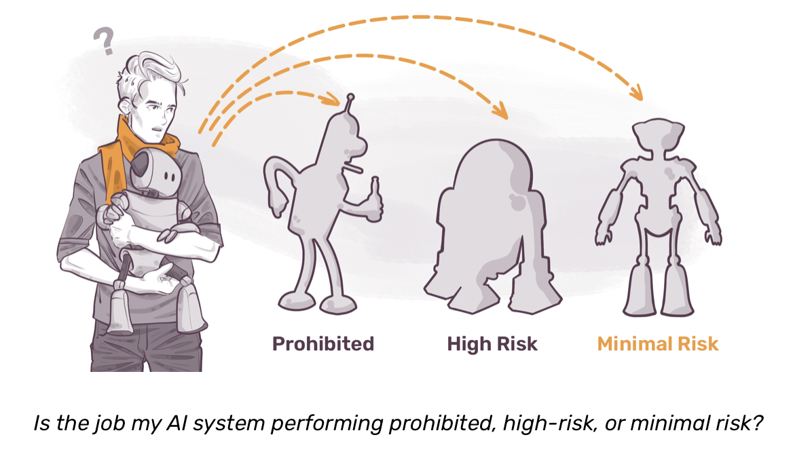
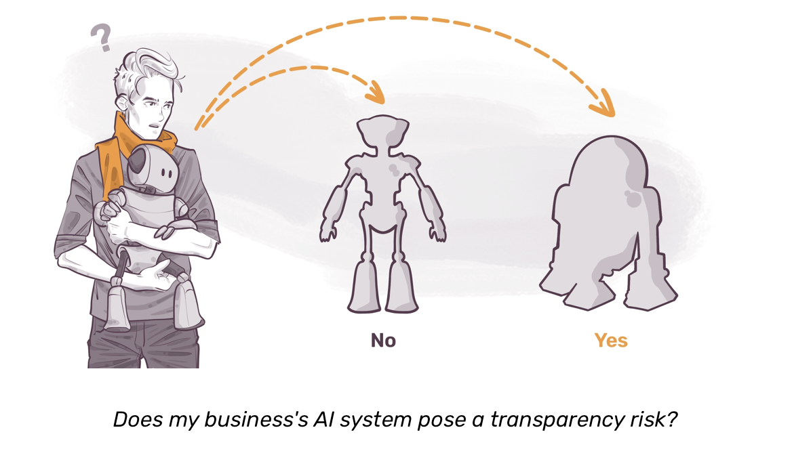
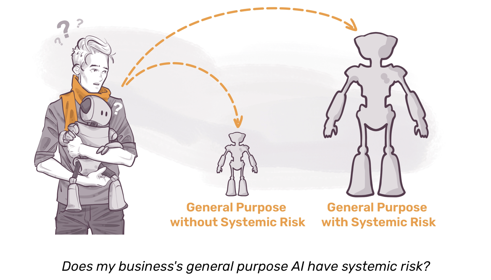
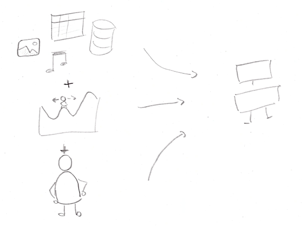
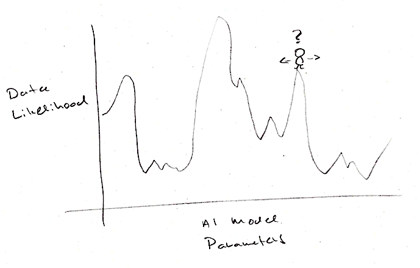

<!-- paginate: false -->
## Management of high risk AI

Dr. Paul Larsen
Head of Data and AI, Korapis d.o.o.
[paul-larsen-data-ai.com](https://paul-larsen-data-ai.com)

 

---
<!-- paginate: true -->
## Outline

* High-risk in the AI Act (this session)
* Optimization and discriminative ML (this session)
* Health insurance segmentation: empirical, logistic regression and decision trees (this + next)
* Reflections on AI definition and model transparency (next session)

---
## The EU's AI Act: what is it?

What? A new EU-wide law about development and usage of AI that follows a "risk-based approach."

Risk-based along "What" categories *prohibited*, *high-risk*, *minimal-risk*, and "How" categories *transparency-risk*, *systemic-risk*.

  

    
  

  

    
  

  

    
  

Source: <a href="https://mkdev.me/posts/when-does-the-eu-ai-act-come-into-force-and-what-does-this-mean-for-your-business">mkdev.me: When does the EU AI Act come into force, and what does this mean for your business?</a>.

---
## High-risk AI in the AI Act

Any AI system that presents risks to **health**, **safety** or **fundamental rights**.

* Bank loan decisions, as access to finance is a protected right for natural persons
* Decisions on access to health or life insurance
* Employment decisions such as hiring or promotions
* Emergency services
* Product safety or infrastructure (e.g. medical devices, protective & safety equipment, toys, ...)

Classification mechanism: **FRIA** = `fundamental rights impact assessment`

---
## What is an AI system?

<!-- _class: split -->

### Cheeky definitions

* Anything that we previously thought only humans could do
* Whatever hasn't been done yet
* A marketing label to make products appear smart

Thought experiment: Imagine all forms of transportation called `vehicle` ([AI Snake Oil](https://press.princeton.edu/books/hardcover/9780691249131/ai-snake-oil), A. Narayanan, S. Kapoor)

### AI Act definition

<blockquote class="small">
[An] 'AI system' means a machine-based system that is designed to operate with varying levels of autonomy and that may exhibit adaptiveness after deployment, and that, for explicit or implicit objectives, infers, from the input it receives, how to generate outputs such as predictions, content, recommendations, or decisions that can influence physical or virtual environments;
</blockquote>

Source: <a href="https://www.europarl.europa.eu/doceo/document/TA-9-2024-0138_EN.html">EU AI Act, Article 3(1)</a>
  
Note: PhD Thesis from <a href="https://www.hwr-berlin.de/search/kontaktdetail/detail/589-jan-dirk-roggenkamp">Professor Jan Roggenkamp, Berlin School of Business and Law</a>'s group identifies / analyzes 27 regulatory definitions of AI.

---
## Technical requirements for high-risk AI

* Data quality and governance (*Article 10*, workshop in-scope)
* Technical documentation (*Article 11*, workshop out-of-scope)
* Record keeping (*Article 12*, workshop out-of-scope)
* Transparency and provision of information regarding operation (*Article 13*, workshop partially in-scope)
* Accuracy, robustness and cybersecurity (*Article 14*, workshop partiall in-scope)

---
## Recall: AI systems vs non-AI software

Main ingredients of AI systems

<ol class="ms-text">
<li><b>Historical data</b> relevant to business domain</li>
<li><b>Optimization algorithms</b> to find best parameters from data</li>
<li><b>Human decisions</b> about data selection, algorithms, "best," ...</li>
</ol>

---
## A stylized introduction to optimization

<!-- _class: split -->

Let $X$ be of size $N\times p$ and $Y$ by $N$-dimensional target variable.

$$
\begin{align*}
    &\hat{\theta} = \underset{\theta\in\mathbb{R}^p}{\mathrm{argmin}}~ \ell(X, \theta) \\
    &\mathrm{subject\,to\,} \mathbf{g}(X, \theta) = \mathbf{0}, \mathbf{h}(X, \theta) \geq \mathbf{0}
\end{align*}
$$

where

* $\ell$ is the **objective function** (e.g. a *likelihood function*)
* $g,h$ are **constraint functions**

---
## Example: health insurance prediction

<!-- _class: split -->

Let $(X_0, X_1, Y)$ be discrete RV:

* $X_0 \in \{0, 1\}$: has skin cancer
* $X_1 \in \{0, 1\}$: has depression
* $Y \in \{0, 1\}$: big claim occurred
* $p_{ijk} = P(X_0 = i, X_1 = j, Y=k)$ (joint probabilities)
* $p_{k|ij} = P(Y = k | X_0 = i, X_1 = j)$ (conditional probabilities)

Sample data $\mathcal{D}$:

x_0 | x_1 | y | interpretation
--|---|---|--
0 | 1 | 1 | no skin-cancer, depression, big claim
0 | 0 | 1 | no skin-cancer, no depression, big claim
0 | 0 | 0 | no skin-cancer, no depression, no big claim
1 | 0 | 1 | skin-cancer, no depression, big claim
0 | 0 | 0 | no skin-cancer, no depression, no big claim
1 | 1 | 1 | skin-cancer, depression, big claim
1 | 0 | 1 | skin-cancer, no depression, big claim
0 | 0 | 0 | no skin-cancer, no depression, no big claim

---
<!-- _class: math-heavy -->
## From optimization to discriminative machine learning

Let $x_n = (x_{n0}, x_{n1}, y_n) \in \{0, 1\}^3$ be data samples.

*Discriminative* Machine Learning (ML): model $\hat{p}_\theta(x) = \hat{P}(Y=1 | X=x; \theta)$, $\theta \in \Theta$

Assuming independent observations, Maximum Likelihood Estimation (MLE) minimizes the negative log-likelihood over the dataset $\mathcal{D}$:

$$
\hat{\theta} = \underset{\theta \in \Theta}{\mathrm{argmin}}~ \ell(\mathcal{D}, \theta)
$$

subject to $\theta \in \Theta$, where the objective function is:

$$
\ell(\mathcal{D}, \theta) = -\sum_{n=1}^N \Big[ y_n \log \hat{p}_\theta(x_n) + (1-y_n) \log(1 - \hat{p}_\theta(x_n)) \Big]
$$

---
<!-- _class: math-heavy -->
## **Empirical**, logistic regression and decision trees

#### Model family: Empirical Distributions
Assign an independent probability to each feature combination.
* *Parameters:* $\theta = (p_{1|ij})_{i,j \in \{0, 1\}}$
* *Constraints:* $0 \leq p_{1|i,j} \leq 1$
* *Model:* $\hat{p}_\theta(1 | x_0, x_1) = p_{1|x_0 x_1}$
* *Optimization:* Analytical

#### Model family: Logistic Regression ...

#### Model family: Decision Trees ...

---
<!-- _class: math-heavy -->
## Empirical model for insurance claims

For the empirical model, assign a distinct parameter to each feature subgroup:
* **Parameters:** $\theta = (p_{1|00}, p_{1|01}, p_{1|10}, p_{1|11})$
* **Model:** $\hat{p}_\theta(1 | x_0, x_1) = p_{1|x_0 x_1}$

Let $S_{ij}$ be the set of $N_{ij}$ records with features $x_0=i$ and $x_1=j$. The negative log-likelihood decouples into independent sums for each subgroup:

$$
\ell_{ij}(p_{1|ij}) = - \sum_{n \in S_{ij}} \Big[ y_n \log(p_{1|ij}) + (1-y_n) \log(1 - p_{1|ij}) \Big]
$$

MLE is solved by (exercise)

$$
\hat{p}_{1|ij} = \frac{1}{N_{ij}} \sum_{n \in S_{ij}} y_n
$$

---
<!-- _class: math-heavy -->
## Empirical, **logistic regression** and decision trees

### Model family: Empirical Distributions ...

### Model family: Logistic Regression
Constrain probabilities to linear combination of features via $\sigma(z) = (1 + e^{-z})^{-1}$.
* *Parameters*: $\theta = (\beta_0, \beta_1, \beta_2)$
* *Constraints*: $\Theta = \mathbb{R}^3$
* *Model*: $\hat{p}_\beta(1 | x_0, x_1) = \sigma(\beta_0 + \beta_1 x_0 + \beta_2 x_1)$
* *Optimization*: Convex, unconstrained continuous optimization. Solved via gradient descent / Newton-Raphson.

### Model family: Decision Trees ...

---
<!-- _class: math-heavy -->
## Logistic Regression for insurance claim prediction

Consider the extended feature vector $\mathbf{x}_n = (1, x_{n0}, x_{n1})^T$ and parameters be $\theta = (\beta_0, \beta_1, \beta_2)^T$.

Model the conditional probability of a big claim as $\hat{p}_\beta(1 | x_{n0}, x_{n1}) = \sigma(\beta^T \mathbf{x}_n)$.

Negative log-likelihood is
$$
\ell(\mathcal{D}, \beta) = - \sum_{n=1}^N \Big[ y_n \log \hat{p}_\beta(1 | \mathbf{x}_n) + (1-y_n) \log(1 - \hat{p}_\beta(1 | \mathbf{x}_n)) \Big]
$$

Use gradient to iteratively update our parameters using numerical optimization algorithms, e.g., Gradient Descent with learning-rate $\eta > 0$:
$$
\beta^{(t+1)} = \beta^{(t)} - \eta \nabla_\beta \ell(\mathcal{D}, \beta^{(t)})
$$

---
<!-- _class: math-heavy -->
## Empirical, logistic regression and **decision trees**

### Model family: Empirical Distributions ...

### Model family: Logistic Regression ...

### Model family: Decision Trees
Divide the feature space into $M$ disjoint regions $R_m$, assigning a constant probability $q_m$ to each region.
* *Parameters*: $\theta = (\{R_m\}_{m=1}^M, \{q_m\}_{m=1}^M)$
* *Space*: $\Theta$ is the discrete space of valid tree topologies $\times [0, 1]^M$
* *Model*: $\hat{p}_\theta(1 | x_0, x_1) = \sum_{m=1}^M q_m \mathbf{1}_{\{(x_0, x_1) \in R_m\}}$
* *Optimization*: Non-convex and combinatorial. Solved via greedy heuristic search (e.g., CART algorithm).

---
<!-- _class: math-heavy -->
## Decision Trees for insurance claim prediction

Feature space partitioned into $M$ disjoint regions $R_m$, each having constant proby $q_m$. Resulting parameters $\theta = (\{R_m\}_{m=1}^M, \{q_m\}_{m=1}^M)$.

Model the conditional probability as $\hat{p}_\theta(1 | x_{n0}, x_{n1}) = \sum_{m=1}^M q_m \mathbf{1}_{\{(x_{n0}, x_{n1}) \in R_m\}}$.

Negative log-likelihood evaluates the purity of each region:
$$
\ell(\mathcal{D}, \theta) = - \sum_{m=1}^M \sum_{n: (x_{n0}, x_{n1}) \in R_m} \Big[ y_n \log q_m + (1-y_n) \log(1 - q_m) \Big]
$$

Optimization: Greedy recursive partitioning (e.g., CART algorithm) to split regions, finding optimal leaf probabilities via the empirical mean:
$$
\hat{q}_m = \frac{1}{N_m} \sum_{n: (x_{n0}, x_{n1}) \in R_m} y_n
$$

---
## Recap and up-next

<!-- _class: split -->

* AI system that affects health, safety or fundamental rights **high-risk**, including access to finance, health or life insurance
* AI differs from other software due to historical data and optimization, shares importance of human decisions
* Prediction of health claims as MLE for empirical, logistic regression and decision trees

### Up next

* Extend binary prediction to customer segmentation on less-simple data
* Required high-risk practices (splitting of data, impact on subpopulations)
* Reflections on AI or not in high-risk domains

